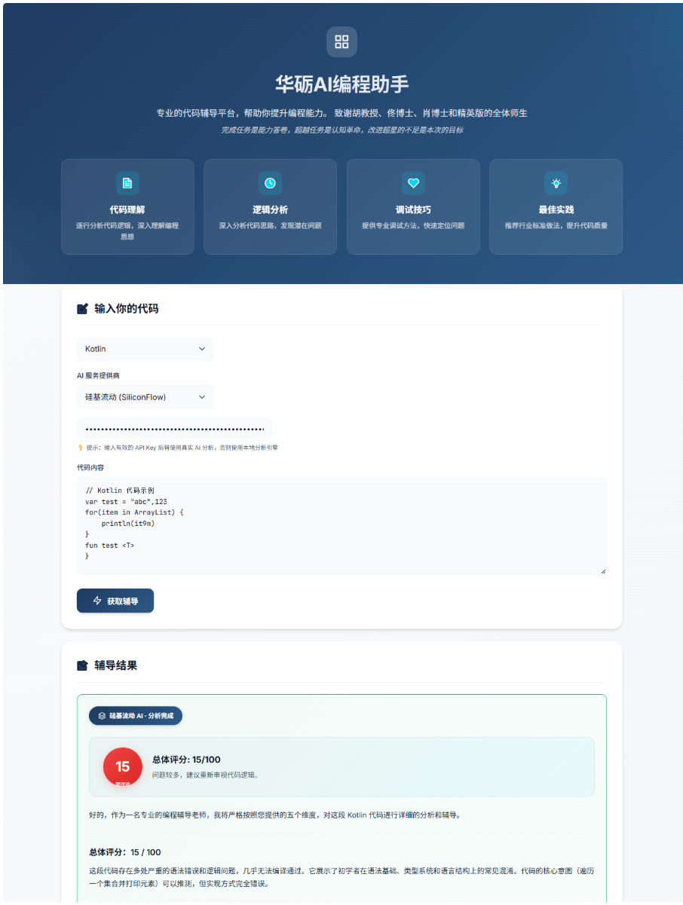

# elite20-starter-LH — AI Programming Assistant

## Personal Info

- **Name**：LIHUAOK
- **Focus**：AI Programming Assistant | Programming Learning Tutor
- **GitHub**：https://github.com/lihuaok/elite20-starter-LH
- **Personal Website**：<https://mp.weixin.qq.com/s/0s9gGt3-HIIvOPeBmaWiqA>
- **Motto**：Completing tasks is an ability test; transcending tasks is a cognitive revolution

## Project Goals

Establish a set of **detailed and traceable AI programming tutoring workflows for the learning process**. Through human-AI collaboration, help learners improve their programming abilities. In the long term, continuously enhance design concepts and technologies to create the best AI programming tutoring workflow.

## Assignment Structure

| Directory                             | Content                                                                       |
| ------------------------------------- | ----------------------------------------------------------------------------- |
| [prompts/](prompts)                   | D4 Prompt Trace, documenting tutoring prompt evolution (P1 → P2 → P3)         |
| [reflections/](reflections)           | D1 Reflection, learning insights and issue records                            |
| [artifacts/](artifacts)               | D5 Skill invocation logs, D9 programming tutoring case and verification chain |
| [coordinate-cards/](coordinate-cards) | D8 Coordination card, workflow design                                         |
| [kstar/](kstar)                       | D7 K-S-T-A-R knowledge star worksheet                                         |
| [doc/](doc)                           | 📖 New! Usage documentation                                                   |

## Technology Stack

**AI Model**：DeepSeek (Primary)
**Tutoring Dimensions**：Code Understanding, Logic Analysis, Debugging Techniques, Best Practices, Architecture Design
**Development Tools**：VS Code, Git, GitHub
**AI Skills**：code\_reviewer, bug\_finder, best\_practice, architecture\_guide

## Completed Assignments

- [ ] D1 — Reflection
- [ ] D4 — Prompt Trace (P1-P3 iterations)
- [ ] D5 — Skill Invocation Logs
- [ ] D7 — K-S-T-A-R Knowledge Star
- [ ] D8 — Coordination Card
- [ ] D9 — Programming Tutoring Case + Verifiable Chain
- [ ] D10 — Presentation and Review

## Key Deliverables

### Programming Tutoring Standards

| Dimension            | Weight | Description                               |
| -------------------- | ------ | ----------------------------------------- |
| Code Understanding   | 20%    | Clarity of code logic explanation         |
| Logic Analysis       | 20%    | Depth of problem analysis                 |
| Debugging Techniques | 20%    | Providing concrete debugging methods      |
| Best Practices       | 20%    | Recommending industry standard approaches |
| Architecture Design  | 20%    | Code structure and maintainability        |

### Tutoring Feedback Example

```
【Code Tutoring Report】

Overall Score: 85/100

✅ Strengths:
1. Clear code logic and proper variable naming
2. Complete basic functionality
3. Appropriate comments and readability

⚠️ Areas for Improvement:
1. Missing error handling
2. Some functions can be further optimized
3. Test coverage needs improvement

💡 Specific Suggestions:
- Add try-except blocks for edge cases
- Use list comprehensions to simplify loops
- Add unit tests to cover critical logic
```

## Learning Outcomes

### Tutoring Principles

1. **Detailed Explanation**：Line-by-line analysis, ensuring understanding of every line
2. **Track Progress**：Record learning progress, build personal programming portfolio
3. **Concrete Advice**：Every feedback must have actionable suggestions
4. **Positive Guidance**：Acknowledge progress while pointing out issues

## Quick Navigation

→ [📖 Usage Guide](doc/HELP.md) ← New! How to use in Doubao
→ [Prompt Trace Entry](prompts/D4-P1.md)
→ [D1 Reflection](reflections/D1.md)
→ [Skill Invocation Logs](artifacts/D5-skill-invocation.md)
→ [K-S-T-A-R Knowledge Star](kstar/D7-kstar-worksheet.md)
→ [Coordination Card](coordinate-cards/D8-coordinate-card.md)
→ [Programming Tutoring Case](artifacts/D9-artifact-trace.md)


***

**Last Updated**：2026-05-01
